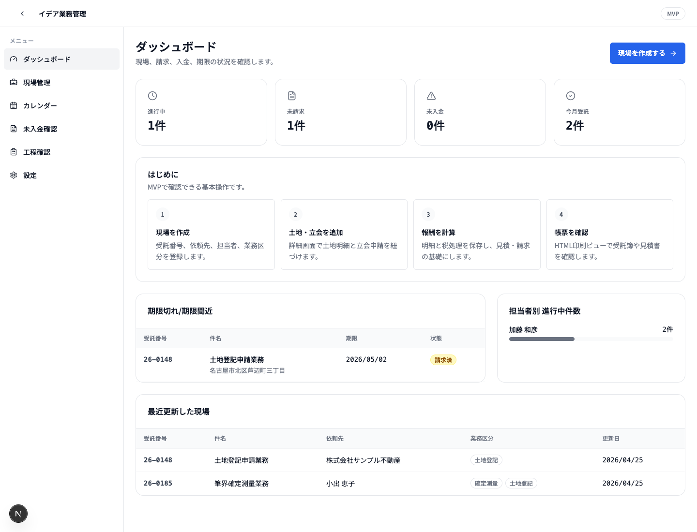
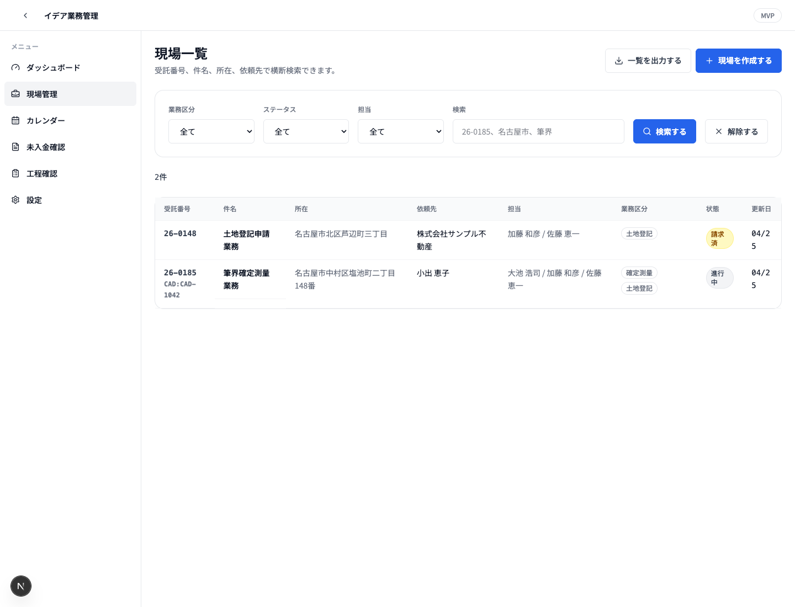
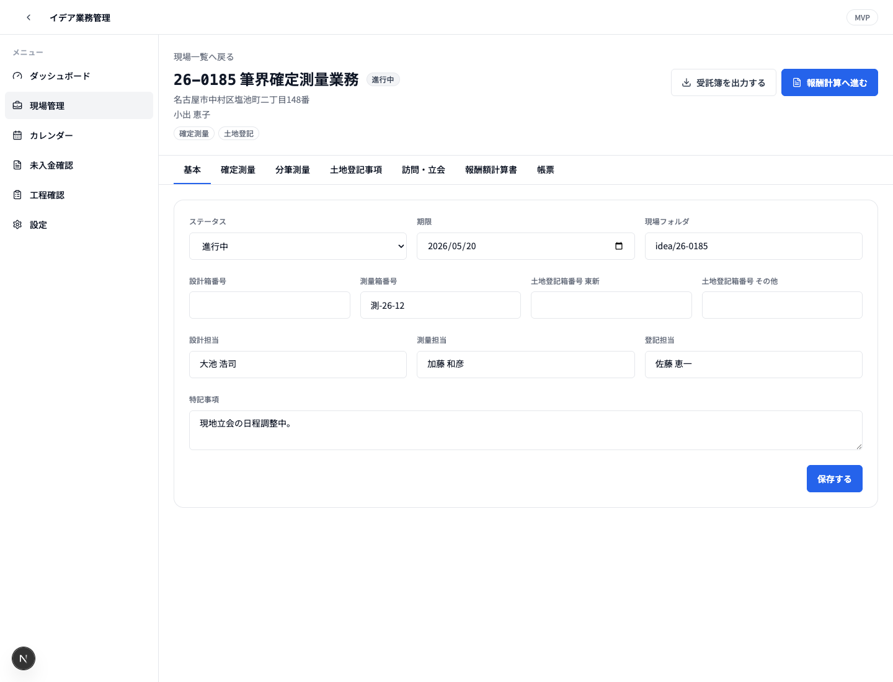
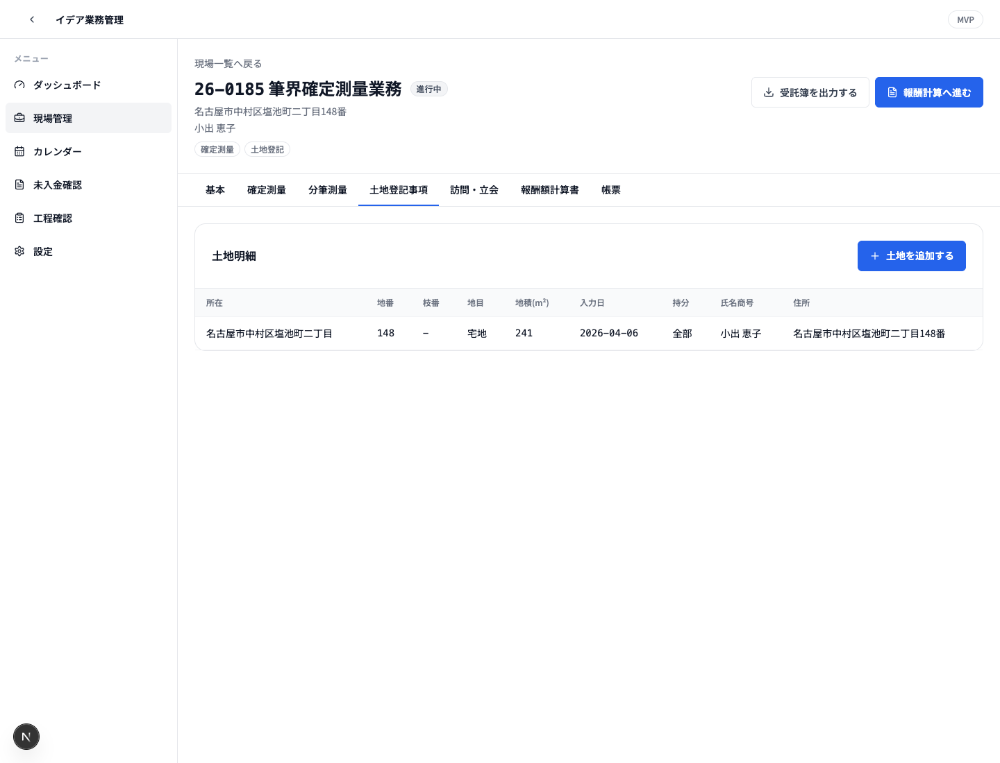
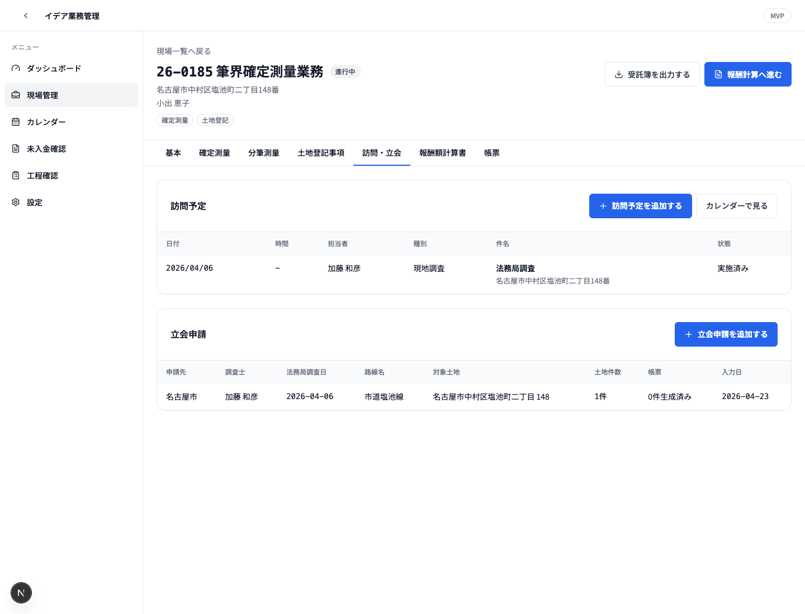
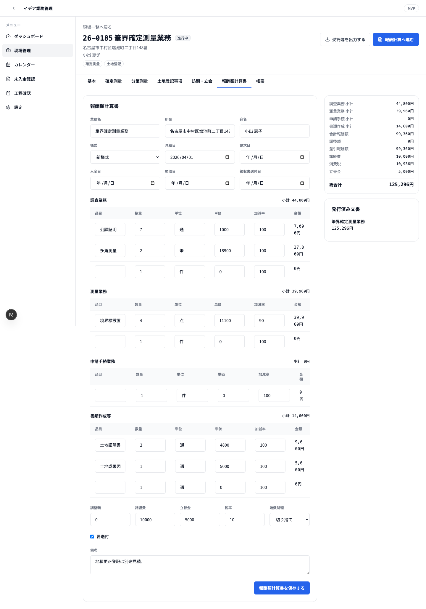
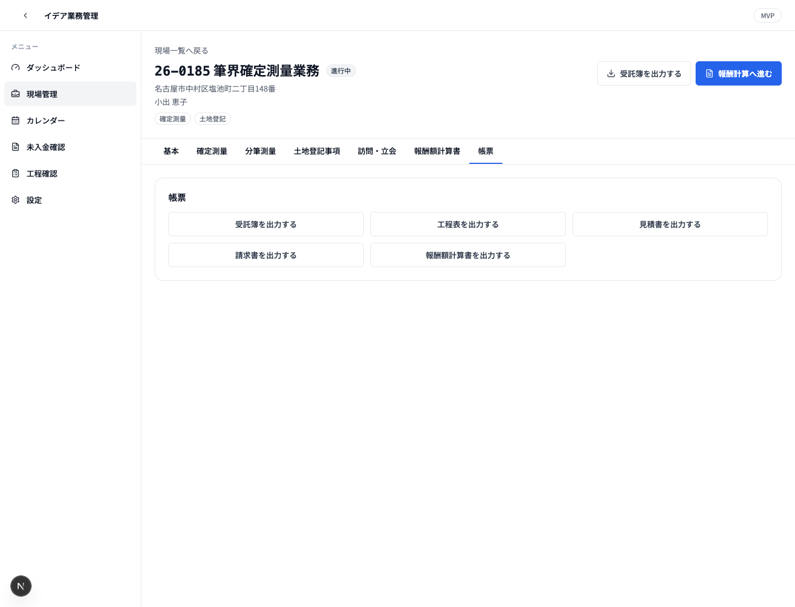
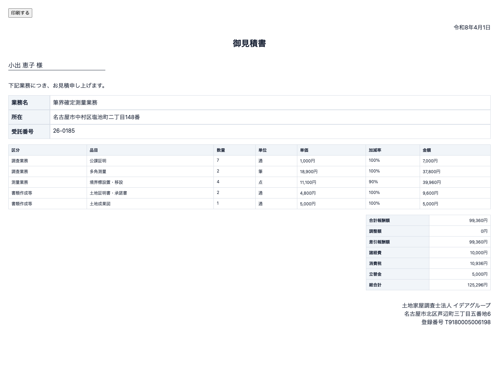

# 提案書 — イデアグループ 基幹業務システム再構築

バージョン: v0.1 / 作成日: 2026-04-27  
対象: 現行 Access / 周辺フォーム画像をもとにした、新システムの対応範囲説明

---

## 1. 本書の目的

本書は、現行で使用されている Access 画面・周辺フォーム・帳票画像が、新しい基幹業務システムのどの機能に置き換わるかを説明するための概要提案書です。

単に「Access を Web 化する」という説明ではなく、以下を明確にします。

- 現行画像のどの業務を、G-DX 側のどの画面・データで受けるか
- 勤怠・経費など、G-DX ではなく Lark 側で構築する範囲はどこか
- 現場、土地、立会申請、報酬計算、帳票が 1 つの案件データとして連動すること
- 現時点の MVP で確認できる範囲と、本番構築で拡張する範囲

本資料内の画像は、現行システムの参考画像です。画像そのものをそのまま再現するのではなく、現行画面が担っている業務機能を、新システム上で整理・統合して再構築します。

---

## 2. 提案の要旨

現行業務は、Access の業務管理・現場フォーム・報酬額計算・立会申請に加えて、勤怠・経費の別システムが併存しています。新システムでは、案件を中心にした G-DX と、承認業務に強い Lark を組み合わせ、次の形に再構成します。

| 領域 | 新システムでの受け皿 | 位置づけ |
|---|---|---|
| 業務管理 / 受託簿 / 一覧 / 検索 | G-DX | 案件管理の入口 |
| 現場フォーム / 多タブの現場カルテ | G-DX | 案件詳細画面 |
| 土地明細 / 所有者 / 隣地情報 | G-DX | 立会申請・帳票の共通データ |
| 立会申請フォーム / 立会帳票 | G-DX | 申請データ作成、管轄別帳票生成 |
| 報酬額計算 / 見積 / 請求 / 領収 | G-DX | 金額計算、帳票発行、入金管理 |
| 勤怠届出 | Lark Base + 承認 | 社員申請・上長承認・経理確定 |
| 経費精算 | Lark Base + 承認 + Anycross | 領収書添付、承認、会計 TXT 連携 |

現在の MVP では、G-DX 側の中核として、ダッシュボード、現場一覧、現場新規作成、現場詳細、土地明細、立会申請、報酬額計算、帳票ビューまで動作確認できる状態です。本番構築では、認証、権限、PostgreSQL 化、15 タブ完全対応、PDF / Word 差込帳票、Lark 連携、Access データ移行を進めます。

---

## 3. 全体像

```text
依頼・受託
  ↓
G-DX 現場作成
  - 受託番号
  - 件名 / 所在
  - 依頼先 / 担当者
  - 業務区分
  ↓
現場カルテ
  - 確定測量 / 分筆測量などの工程
  - 土地明細 / 所有者
  - 訪問予定 / 立会申請
  ↓
帳票・連動処理
  - 受託簿
  - 工程表
  - 立会申請帳票
  - 見積書 / 請求書 / 報酬額計算書
  ↓
請求・入金・進捗確認
  - 未請求 / 未入金
  - 期限管理
  - 担当者別進行件数

勤怠・経費
  ↓
Lark Base / 承認
  ↓
Anycross / 会計 TXT
```

重要なのは、各機能が個別フォームとして独立するのではなく、案件 ID を軸に連動する点です。土地明細を一度入力すれば、立会申請の対象土地、所有者一覧、封筒、委任状、報酬計算や進捗報告の基礎データとして使えます。報酬額計算で請求日や入金日を登録すると、現場ステータスや未請求・未入金のダッシュボードにも反映されます。

---

## 4. 作成中システムの画面

以下は、現在作成中の G-DX 側 MVP 画面です。現行 Access / 周辺フォームの画像だけでは「新システム側でどの画面に置き換わるのか」が伝わりにくいため、実際に動作している画面を合わせて掲載します。

### 4.1 ダッシュボード



ダッシュボードでは、進行中、未請求、未入金、今月受託、期限切れ / 期限間近、担当者別の進行中件数、最近更新した現場を確認できます。現行の業務管理メニューや一覧に分散していた確認作業を、最初の画面に集約します。

### 4.2 現場一覧



現場一覧では、受託番号、件名、所在、依頼先で横断検索できます。業務区分、ステータス、担当の絞り込みもでき、現行の「業務区分ごとの一覧表示」を Web 画面として置き換えます。

### 4.3 現場詳細 基本情報



現場詳細では、受託番号、件名、所在、依頼先、業務区分、ステータスを案件単位で管理します。箱番号、期限、現場フォルダ、特記事項もこの画面にまとめ、各タブへ進む起点にします。

### 4.4 土地明細と立会申請

<table>
  <tr>
    <td width="50%"></td>
    <td width="50%"></td>
  </tr>
</table>

土地明細では、所在、地番、枝番、地目、地積、所有者、住所、持分を案件に紐づけて登録します。立会申請では、その土地明細を対象土地として選択し、申請先、調査士、法務局調査日、路線名、訪問予定へ連動させます。

### 4.5 報酬額計算と帳票出力

<table>
  <tr>
    <td width="50%"></td>
    <td width="50%"></td>
  </tr>
</table>

報酬額計算では、調査業務、測量業務、申請手続、書類作成の明細を入力し、調整額、諸経費、立替金、消費税、総合計を計算します。帳票タブからは、受託簿、工程表、見積書、請求書、報酬額計算書へ出力できます。

### 4.6 見積書出力ビュー



見積書は、現場と報酬額計算書のデータをもとに生成します。MVP では HTML 印刷ビューとして確認できる状態で、本番構築では PDF 化、押印画像、現行帳票レイアウトへの精密調整を行います。

---

## 5. 現行画像と新システムの対応

### 5.1 業務管理システム Ver.2

現行画像フォルダ: `イデア業務管理`  
画像数: 14 枚

<table>
  <tr>
    <td width="50%"></td>
    <td width="50%"></td>
  </tr>
</table>

#### 新システムで補う部分

| 現行画像が担う役割 | G-DX での対応画面 / 機能 |
|---|---|
| Main Switchboard、各業務メニュー | `/dashboard`、サイドナビ、現場一覧への導線 |
| 現場一覧、業務区分別一覧 | `/cases` の検索・フィルタ・業務区分絞り込み |
| 受託番号、件名、所在、依頼先の管理 | 現場データ `CaseRecord` として一元管理 |
| 受託簿、工程表、一覧印刷 | 帳票 API / HTML 印刷ビュー、将来 PDF 化 |
| 進捗、請求、入金の把握 | ダッシュボードの進行中・未請求・未入金・期限管理 |

#### 連動の説明

業務管理画像にあるメニューや一覧は、新システムでは「案件管理の入口」として統合します。現場を作成すると、受託番号、依頼先、担当者、業務区分、期限、ステータスが登録され、現場一覧、ダッシュボード、帳票出力に同じデータが流れます。

現在の MVP では、現場一覧の検索、業務区分・ステータス・担当フィルタ、一覧出力、現場作成、ダッシュボード集計まで実装済みです。本番構築では、Access データ移行、権限、監査ログ、帳票 PDF 化を追加します。

---

### 5.2 現場フォーム

現行画像フォルダ: `イデア現場フォーム`  
画像数: 13 枚

<table>
  <tr>
    <td width="50%"></td>
    <td width="50%"></td>
  </tr>
</table>

#### 新システムで補う部分

| 現行画像が担う役割 | G-DX での対応画面 / 機能 |
|---|---|
| 多タブの現場カルテ | `/cases/[caseId]` のタブ UI |
| 基本情報、箱番号、特記事項 | 現場詳細の基本タブ |
| 確定測量、分筆測量の工程日付 | 現場詳細の確定測量 / 分筆測量タブ |
| 土地登記事項、土地明細、所有者 | 土地明細タブ |
| 立会申請への導線 | 立会申請タブ |
| 報酬額計算書への導線 | 報酬額計算書タブ |
| 写真・PDF・現場フォルダ | 本番では S3 / Lark Drive 連携で管理 |

#### 連動の説明

現場フォームは、新システムの最重要画面です。現行の多タブ Access フォームを、Web の現場詳細画面として整理し、案件ごとに工程、土地、立会、報酬、帳票を同じ場所から扱えるようにします。

現在の MVP では、基本情報、確定測量、分筆測量、土地明細、立会申請、報酬額計算書、帳票の 7 タブ相当を実装済みです。本番構築では、要件定義書にある 15 タブ、設計、仮測量、その他測量、写真・PDF、隣地確認、土地登記、建物登記、農地転用、寄付帰属、コンサル測量まで拡張します。

---

### 5.3 報酬額計算書入力フォーム

現行画像フォルダ: `イデア報酬額計算書入力フォーム`  
画像数: 14 枚

<table>
  <tr>
    <td width="50%"></td>
    <td width="50%"></td>
  </tr>
</table>

#### 新システムで補う部分

| 現行画像が担う役割 | G-DX での対応画面 / 機能 |
|---|---|
| 報酬額計算の入力 | 現場詳細の報酬額計算書タブ |
| 調査業務、測量業務、申請手続、書類作成の明細 | 明細テーブルとして保存 |
| 単価、数量、加減率、税計算 | サーバー側計算ロジック |
| 見積書、請求書、報酬額計算書 | 帳票 API で同一レコードから出力 |
| 見積日、請求日、入金日、領収書送付日 | 請求・入金ステータスとダッシュボードへ連動 |

#### 連動の説明

報酬額計算書は、単独の計算フォームではなく、案件に紐づく金額管理として再構築します。1 件の報酬データから、見積書、請求書、報酬額計算書、将来的には領収書まで同期発行します。

現在の MVP では、明細入力、セクション別小計、調整額、諸経費、立替金、税率、端数処理、総合計、見積書・請求書・報酬額計算書の HTML 印刷ビューを実装済みです。本番構築では、単価マスタの有効期間管理、旧様式 / 新様式の完全対応、PDF 出力、押印画像、会計 TXT 出力を追加します。

---

### 5.4 立会申請フォーム

現行画像フォルダ: `イデア立ち会い申請フォーム`  
画像数: 6 枚

<table>
  <tr>
    <td width="50%"></td>
    <td width="50%"></td>
  </tr>
</table>

#### 新システムで補う部分

| 現行画像が担う役割 | G-DX での対応画面 / 機能 |
|---|---|
| 申請先の選択 | 名古屋市 / 北名古屋市 / 愛知県 / その他の管轄選択 |
| 調査士、法務局調査日、路線名 | 立会申請レコードとして保存 |
| 申請地、隣接地、対側地 | 現場の土地明細から選択 |
| 入力順 / 地番順 | 並び順の切替 |
| 過去申請の再利用 | 本番ではコピー新規作成を実装 |

#### 連動の説明

立会申請は、現場フォームの土地明細と直接連動します。土地・所有者を二重入力するのではなく、現場に登録済みの土地から申請対象を選び、管轄別に必要な帳票へ差し込みます。

現在の MVP では、立会申請の登録、申請先、調査士、法務局調査日、路線名、対象土地、土地件数、訪問予定との連携を実装済みです。本番構築では、管轄別の帳票テンプレート差込、PDF 生成、生成物の保管、過去申請コピーを追加します。

---

### 5.5 立会申請帳票

現行画像フォルダ: `イデア立ち会い申請帳票`  
画像数: 20 枚

<table>
  <tr>
    <td width="33%"></td>
    <td width="33%"></td>
    <td width="33%"></td>
  </tr>
</table>

#### 新システムで補う部分

| 現行帳票画像が担う役割 | G-DX での対応 |
|---|---|
| 隣接地所有者等一覧表 | 土地明細・所有者から自動生成 |
| 土地境界立会のお願い | 所有者別に差込生成 |
| 委任状 | 調査士・申請地・所有者情報を差込 |
| 名古屋市 / 北名古屋市 / 愛知県の各種申請書 | 申請先に応じてテンプレート切替 |
| 封筒、挨拶状、確認書、報告書 | 立会申請レコードから一括生成 |

#### 連動の説明

帳票は、現場・土地・所有者・調査士・申請先・路線名をもとに生成します。現行の Word / Excel 帳票原本をテンプレート化し、G-DX から `docxtemplater` で差し込み、必要に応じて PDF 化します。

この部分は本番構築でテンプレート原本の入手後に精密実装します。MVP では帳票ビューの基礎として、受託簿、工程表、見積書、請求書、報酬額計算書の HTML 印刷ビューを先に実装しています。

---

### 5.6 勤怠

現行画像フォルダ: `イデア勤怠`  
画像数: 10 枚

<table>
  <tr>
    <td width="50%"></td>
    <td width="50%"></td>
  </tr>
</table>

#### 新システムで補う部分

| 現行画像が担う役割 | 新システムでの対応 |
|---|---|
| 特別休暇、欠勤、有給、休日出勤、残業、早退、遅刻の届出 | Lark Base の届出テーブル |
| 下書き、提出、承認待ち、確定 | Lark 承認フロー |
| 上長承認、経理承認 | Lark Approval の多段承認 |
| 社員別、月次、年次集計 | Lark Base ビュー / CSV 出力 |

#### 連動の説明

勤怠は、G-DX の現場管理画面には入れず、Lark 側に構築します。理由は、勤怠が案件詳細よりも社員申請・承認・通知・モバイル利用に近い業務だからです。

ただし完全に切り離すのではなく、社員マスタ、ロール、Lark ユーザー ID を G-DX と同期し、同じ社員情報を使います。これにより、G-DX の担当者管理と Lark の承認フローで人名・所属・権限がずれない構成にします。

---

### 5.7 経費精算

現行画像フォルダ: `イデア経費`  
画像数: 2 枚

<table>
  <tr>
    <td width="50%"></td>
    <td width="50%"></td>
  </tr>
</table>

#### 新システムで補う部分

| 現行画像が担う役割 | 新システムでの対応 |
|---|---|
| 経費明細入力 | Lark Base の経費精算テーブル |
| 駐車料、購入物、支払先、備考、金額 | 明細行として管理 |
| 領収書添付 | Lark Base 添付 |
| 上長・経理承認 | Lark 承認フロー |
| 管理者一覧、会計 TXT 出力 | Anycross で会計 TXT 生成 |

#### 連動の説明

経費精算も勤怠と同様に Lark 側へ寄せます。領収書添付、スマホ入力、承認通知、管理者確認に Lark が向いているためです。会計ソフト向け TXT は、現行フォーマットを確認したうえで Anycross で生成します。

---

## 6. 作成済み MVP で確認できる範囲

| 画面 / 機能 | パス | 現在の状態 |
|---|---|---|
| ダッシュボード | `/dashboard` | 進行中、未請求、未入金、今月受託、期限、担当者別件数、最近更新を表示 |
| 現場一覧 | `/cases` | 検索、業務区分、ステータス、担当フィルタ、一覧出力 |
| 現場新規作成 | `/cases/new` | 受託番号、件名、所在、依頼先、担当者、業務区分を登録 |
| 現場詳細 | `/cases/[caseId]` | 基本、確定測量、分筆測量、土地、立会申請、報酬、帳票タブ |
| 土地明細 | 現場詳細内 | 土地・所有者を追加、一覧表示 |
| 立会申請 | 現場詳細内 | 申請先、調査士、対象土地、路線名を登録 |
| 訪問予定 | 現場詳細 / `/calendar` | 予定日、担当者、種別、状態を登録、カレンダー表示へ連動 |
| 報酬額計算 | 現場詳細内 | 明細、税計算、見積日、請求日、入金日、総合計を保存 |
| 帳票ビュー | `/api/...` | 現場一覧、受託簿、工程表、見積書、請求書、報酬額計算書の HTML 印刷ビュー |
| テスト | `pnpm test` | 報酬計算、和暦変換の単体テスト |

MVP の保存先は `data/idea-store.json` です。本番では PostgreSQL / Supabase などのデータベースへ移行し、認証・権限・監査ログ・バックアップを本実装します。

---

## 7. データ連動の具体例

| 操作 | 連動先 | 効果 |
|---|---|---|
| 現場を作成する | 現場一覧、ダッシュボード、帳票 | 受託番号を軸に全機能の親データになる |
| 業務区分を付ける | 一覧フィルタ、現場詳細タブ、進捗管理 | 確定測量、分筆、土地登記などの業務単位で絞り込める |
| 期限を入力する | ダッシュボードの期限切れ / 期限間近 | 対応漏れを一覧で確認できる |
| 土地明細を追加する | 立会申請、所有者一覧、帳票 | 地番・地目・所有者を二重入力しない |
| 立会申請を作成する | 訪問予定、管轄別帳票、生成履歴 | 申請先に応じた帳票生成につながる |
| 報酬額計算書を保存する | 見積書、請求書、報酬額計算書、未請求 / 未入金 | 請求・入金の管理と帳票発行がつながる |
| 入金日を登録する | 現場ステータス、未入金件数 | 入金済みとして管理できる |
| 勤怠・経費を Lark で申請する | 承認フロー、社員マスタ、会計 TXT | 申請・承認・経理処理を統一できる |

---

## 8. 導入効果

| 現行の課題 | 新システムでの改善 |
|---|---|
| Access、Web フォーム、帳票、勤怠、経費が分かれている | G-DX と Lark に役割分担し、案件・申請・承認の流れを整理する |
| 同じ土地・所有者・依頼先情報を複数画面や帳票に転記する | 案件 ID と土地明細を中心に、立会申請・帳票・報酬計算へ流用する |
| 進捗、請求、入金、期限が担当者ごとの把握になりやすい | ダッシュボードで期限、未請求、未入金、担当者別件数を確認する |
| 帳票作成が個別テンプレートや手作業に依存する | 現行帳票原本をテンプレート化し、案件データから差込生成する |
| 勤怠・経費の申請、承認、添付、通知が別管理になりやすい | Lark Base / 承認でスマホ入力、承認、通知、履歴を一元化する |
| Access の同時利用、ローカル依存、属人化が残る | Web 化、権限管理、監査ログ、DB 化により運用基盤を安定させる |

本提案の効果は、単に画面を新しくすることではありません。現場業務で発生する情報を一度登録し、その情報を進捗管理、立会申請、帳票、請求、入金確認まで使い回せる状態にすることです。

---

## 9. 導入ステップ案

| フェーズ | 内容 | 目的 |
|---|---|---|
| フェーズ 0 | 現行 Access、帳票原本、会計 TXT、運用ルールの確認 | 仕様の抜け漏れと属人ルールを洗い出す |
| フェーズ 1 | 認証、権限、DB、マスタ、共通 UI の整備 | 本番運用できる土台を作る |
| フェーズ 2 | 現場一覧、現場詳細 15 タブ、土地・所有者管理 | Access の業務管理・現場フォームを置き換える |
| フェーズ 3 | 報酬額計算、見積、請求、領収、帳票 PDF | 金額計算と帳票発行を案件データと連動させる |
| フェーズ 4 | 立会申請、管轄別帳票、生成物保管 | 立会申請フォームと帳票群を置き換える |
| フェーズ 5 | Lark 勤怠・経費、承認、会計 TXT | 申請・承認・経理処理を Lark に集約する |
| フェーズ 6 | Access データ移行、並行稼働、受入テスト | 実データで確認し、本稼働へ移行する |

スケジュールと優先順位は、先方の業務影響を見ながら調整します。勤怠・経費を Lark で先行稼働し、G-DX 側の現場管理・帳票を段階的に置き換える進め方も可能です。

---

## 10. 先方説明用トーク

説明時は、以下の順で話すと伝わりやすくなります。

1. まず、現行画像は「画面デザインの再現対象」ではなく「業務機能の棚卸し材料」として使っていることを伝える。
2. 業務管理と現場フォームは、G-DX の案件管理と現場詳細に統合されると説明する。
3. 報酬額計算、立会申請、帳票は、案件に紐づくサブ機能として連動すると説明する。
4. 勤怠・経費は、G-DX ではなく Lark 側で作る範囲だと明確に分ける。
5. すでに MVP として、現場一覧、現場詳細、土地、立会、報酬、帳票ビューまで動く形があると伝える。
6. 本番構築では、現行 Access の全タブ・帳票原本・会計 TXT 仕様を確認し、データ移行と帳票再現を進めると説明する。

---

## 11. 本番構築で追加する主な作業

| 優先度 | 作業 | 内容 |
|---|---|---|
| P0 | 認証・権限 | Lark OAuth SSO、ロール制御、案件担当者制御 |
| P0 | データベース化 | JSON 保存から PostgreSQL / Supabase へ移行 |
| P0 | 監査ログ | 閲覧、更新、帳票出力、削除の履歴 |
| P1 | 現場詳細 15 タブ化 | 要件定義書の全タブを実装 |
| P1 | 帳票 PDF 化 | HTML / Word テンプレートから PDF 生成 |
| P1 | マスタ管理 | 社員、単価、法務局、依頼先、CSV 入出力 |
| P2 | 立会申請帳票 | 管轄別 docx 差込、一括生成、保管 |
| P2 | Lark 勤怠・経費 | Base、承認、Anycross、会計 TXT |
| P2 | Access 移行 | 既存データ、添付、帳票原本の移行 |
| P3 | 外部ポータル / BI | 依頼先向け進捗共有、売上・稼働分析 |

---

## 12. 先方に確認・提供いただきたいもの

| 必要資料 | 目的 |
|---|---|
| Access `.accdb` / `.mdb` 原本 | テーブル、クエリ、VBA、レポートの確認 |
| 現行 Word / Excel 帳票原本 | 帳票テンプレート化、差込項目確認 |
| 会計 TXT サンプル | 経費・報酬の会計連携仕様確認 |
| 依頼先、社員、単価、法務局マスタ | 初期データ移行 |
| Lark 管理者権限 / 組織構成 | SSO、承認フロー、Base 構築 |
| 実際の業務シナリオ 3〜5 件 | 並行稼働テスト、帳票比較、計算検証 |

---

## 13. 結論

今回の新システムは、現行画像をもとにした単なる画面模写ではありません。Access で分かれていた業務管理、現場フォーム、立会申請、帳票、報酬額計算を、案件 ID を中心に再整理し、同じデータを複数業務に連動させる再構築です。

特に、現場・土地・立会・報酬・帳票が 1 つの案件詳細からつながることで、二重入力、転記、帳票作成の手戻りを減らせます。勤怠・経費は Lark に寄せることで、申請・承認・通知・モバイル入力を標準機能に乗せられます。

現時点の MVP は、本番完成版ではありませんが、先方に「この画像の業務は、この G-DX / Lark の機能として補う」という説明ができる土台として、すでに動く範囲を持っています。今後は、現行 Access 原本と帳票原本を確認しながら、実業務に合わせた精密な移行・帳票再現・権限設計へ進めます。
